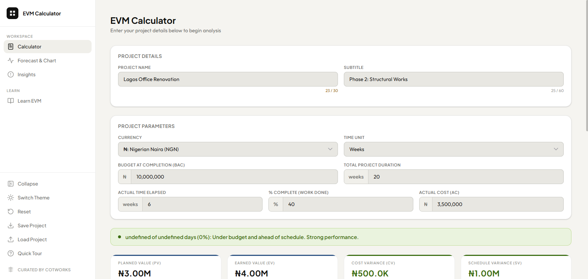

# EVM Calculator

This is a complete project performance tool built around Earned Value Management (EVM). It takes five inputs: budget, duration, time elapsed, percentage complete, and actual cost; and turns them into a full cost and schedule analysis, forecast, and plain-English breakdown of what the numbers actually mean.

**[Live Demo](https://crypticot.github.io/evm-calc/)**



---

## Why this exists

Most EVM tools are spreadsheets. You fill in numbers, get a CPI, and then have to figure out what to do with it yourself. That works fine if you already know EVM well, but it puts all the interpretation burden on the user, and on real projects, the person running the numbers isn't always the one who designed the framework.

This tool is built around the idea that the output of an EVM analysis should be readable, not just correct. The numbers are there, but so is a plain-English explanation of what each one means for this specific project, right now. A CPI of 0.73 should tell you "you are spending ₦1 and earning ₦0.73 of value" without requiring the reader to already know what CPI means.

It also handles the part most spreadsheet tools skip: the forecast. The chart shows where your project is headed, not just where it is, and lets you bend the forecast curve by entering expected progress at specific future periods.

---

## What it does

- **Calculator**: enter five inputs and get a full EVM analysis instantly: PV, EV, AC, CV, SV, CPI, SPI, EAC, ETC, VAC, and TCPI, with a status banner summarising the bottom line at a glance
- **Forecast & Chart**: an interactive line chart plotting PV, EV, AC, and their forecast extensions across the full project timeline; toggle individual metrics on and off; override expected progress at any future period to model non-linear recovery
- **Insights**: a plain-English analysis panel that explains what each metric means for the current project, without formulas, and written for stakeholders, not just project managers
- **Learn EVM**: a step-by-step explainer that teaches the full EVM framework through one consistent worked example (a Lagos office renovation) from input to forecast; a "Load example project" button populates the calculator with those exact numbers so you can see the tool in action
- **Export**: download the results table as CSV or XLSX, copy it to the clipboard, or download the chart as PNG or PDF; all filenames are specific to the export type
- **Save and Load**: export your full project state as a JSON file and reload it later or on another device
- **Persistent local storage**: your workspace saves automatically between sessions
- **Light and dark themes**, a collapsible sidebar, a guided onboarding tour, and full mobile responsiveness with a bottom navigation bar

---

## Tech stack

Built entirely in vanilla HTML, CSS, and JavaScript. Just open `index.html`.

- [Chart.js](https://www.chartjs.org/): interactive forecast chart
- [SheetJS](https://sheetjs.com/): XLSX export
- [html2canvas](https://html2canvas.hertzen.com/): chart-to-image capture
- [jsPDF](https://github.com/parallax/jsPDF): PDF generation
- Google Fonts: Plus Jakarta Sans (headings) + Outfit (body)

---

## Running it locally

```bash
git clone https://github.com/crypticot/evm-calc.git
cd evm-calc
```

Open `index.html` in any browser. No dependencies to install, no server required.

---

## A few design decisions worth knowing

**Why the forecast assumes linear progress by default.** EVM works from a single snapshot of one percentage complete at one point in time. Without additional data, a straight-line projection is the most honest assumption. The Forecast Overrides panel exists precisely for when you know that an assumption is wrong: enter expected progress at specific future periods, and the chart adjusts accordingly.

**Why EAC uses BAC ÷ CPI rather than alternatives.** There are several EAC formulas in EVM literature. This tool uses the CPI-based formula because it is the most widely validated for forecasting: research consistently shows that CPI rarely improves significantly after a project passes 20% completion, making this the most honest predictor of final cost. The tool surfaces this rule of thumb explicitly in the Learn page.

**Why the status banner gives a single verdict rather than listing all metrics.** CPI and SPI together tell the most important part of the story (cost efficiency and schedule efficiency). The banner combines them into one sentence so a stakeholder can read the headline without parsing a table. The full table is still there for anyone who needs the details.

**Why amounts use comma formatting rather than raw numbers.** Project budgets are large numbers. The difference between ₦1,500,000 and ₦15,000,000 is easy to miss when you're typing fast. Comma formatting makes order-of-magnitude errors visible before they affect the analysis.

---

## Built by

**Chidubem Ojukwu** · [Portfolio](https://crypticot.github.io/cotworks-portfolio/) · [LinkedIn](https://linkedin.com/in/ojukwuii)

Built as part of a learning project, and exists independently as a tool for anyone doing project performance tracking.
